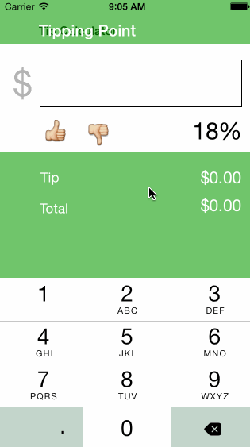

## Tip Calculator

This is a tip calculator which allows you to enter the bill amount then adjust the tip percent up or down from a default tip value.

**Time spent:** 4 hours

Completed User Stories:

- [x] Required: User can enter a bill amount, choose a tip percentage, and see the tip and total values.
- [ ] Required: Settings page to change the default tip percentage.

Notes:

First time using Xcode. Watched the WWDC Intro to Swift and the CodePath Tip Calculator instructional video.

Walkthrough of all user stories:

GIF created with [LiceCap](http://www.cockos.com/licecap/).
